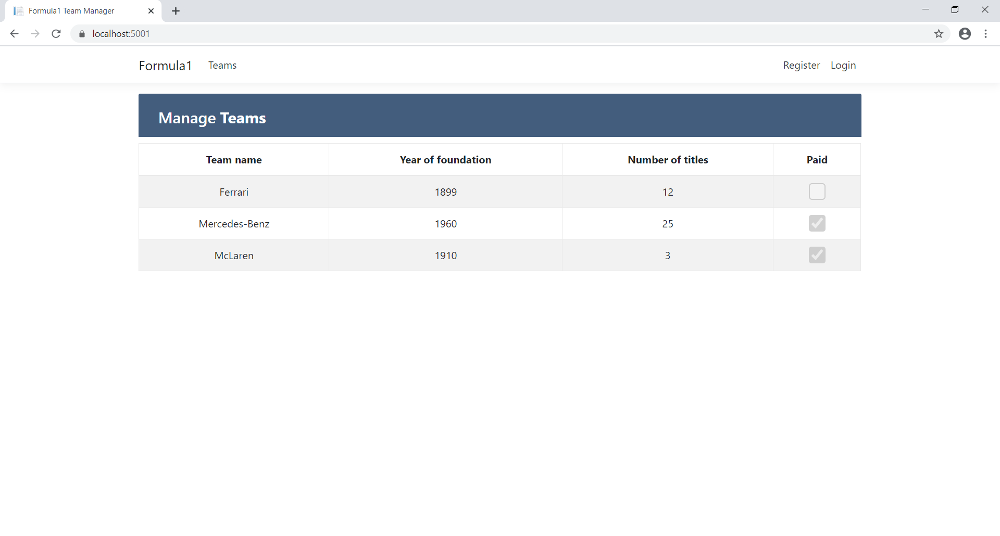
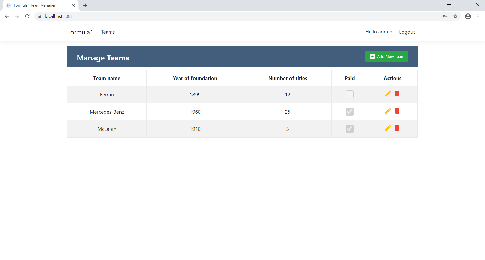
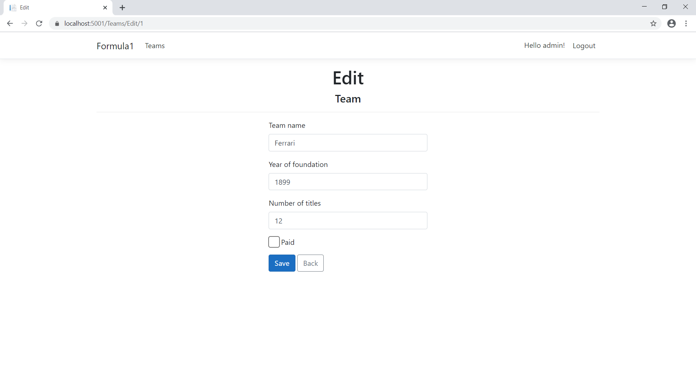

# Formula
Ez egy ASP.NET Core 3.1 illetve Entity Framework Core 3.1 alkalmazásával írt webalkalmazás. A célja, hogy Forma 1-es csapatokat lehessen listázni, létrehozni, módosítani és törölni. A létrehozás, módosítás és törlés csak bejelentkezés után lehetséges. Az adatbázis EF Core Code First megközelítéssel készült, providerként az SQLite InMemory mode-ját használja. A bejelentkezéshez és felhasználókezeléshez az Identity Core segítségével van megvalósítva.

Screenshot: 

Bejelentkezés előtt:

Bejelentkezés után:

Szerkesztés:

